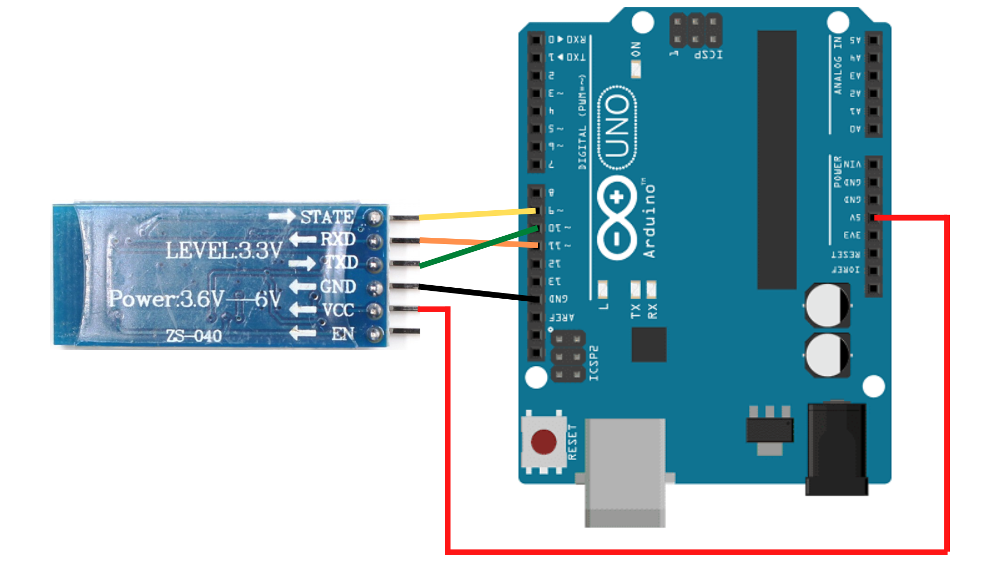
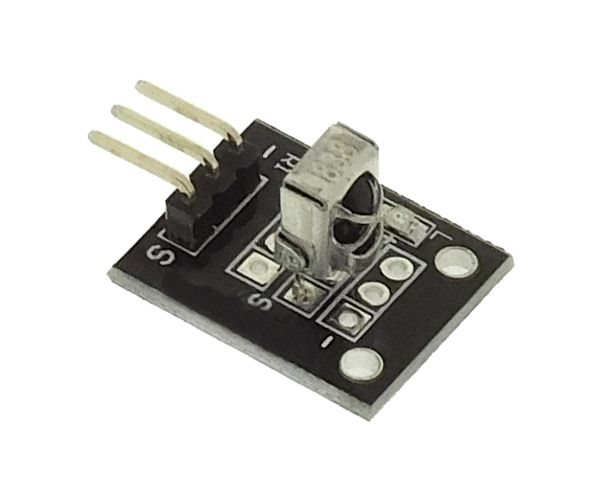

# IR_BLUE_GESTION_LED

 - e-mail : openprogramming23@gmail.com
 - gitHub : https://github.com/RS-malik-el
 - Donation : paypal.me/RachelSysteme

 - @AUTEUR : Exaucé KIMBEMBE / @OpenProgramming
 - DATE : 11/06/2023
 
## @Board : Arduino
Programme Arduino pour contrôler 4 lampes par Bluetooth ou télécommande infrarouge.
Ce code permet d'allumer ou d'éteindre les lampes individuellement en utilisant des signaux Bluetooth ou infrarouges.
 
## @Outils
 - (1) HC-05
 - (1) Relais 4 canaux
 - (1) Recepteur infrarouge 32KHz
 - (1) Télécommande
 - (1) Carte Arduino
 - (4) Lampes
 - 
## @Instructions d'utilisation :
 - 1. Assurez-vous d'avoir correctement connecté les modules Bluetooth et infrarouge à l'Arduino.
 - 2. Téléchargez et installez les bibliothèques nécessaires pour le module Bluetooth et infrarouge.
 - 3. Associez votre appareil Bluetooth avec l'Arduino, ou utilisez une télécommande infrarouge compatible.
 - 4. Envoyez les commandes appropriées (Bluetooth ou infrarouge) pour allumer ou éteindre les lampes
  
## @Notes :
 - Les signaux Bluetooth peuvent être envoyés à partir d'une application mobile ou d'un autre appareil compatible.
 - Assurez-vous d'ajuster les broches utilisées pour les signaux infrarouges et les sorties des lampes en fonction de votre configuration matérielle.

## @Schema de montage hc-05 :

